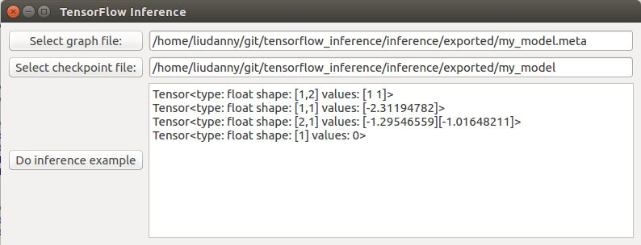

# tf_inference_gui

### What is tf_inference_gui for?

This GUI application is a simple example of how to develop Qt5 GUI with TensorFlow C++ library. In this GUI example, I use this repo's example to do model restoring and inferencing as follows:
https://github.com/PatWie/tensorflow_inference.git

### This GUI looks like 

